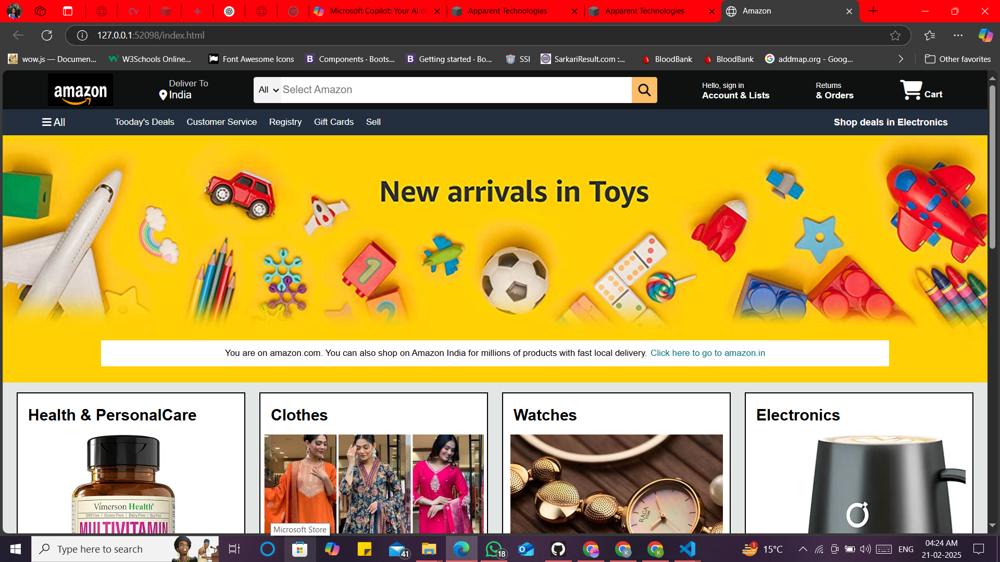
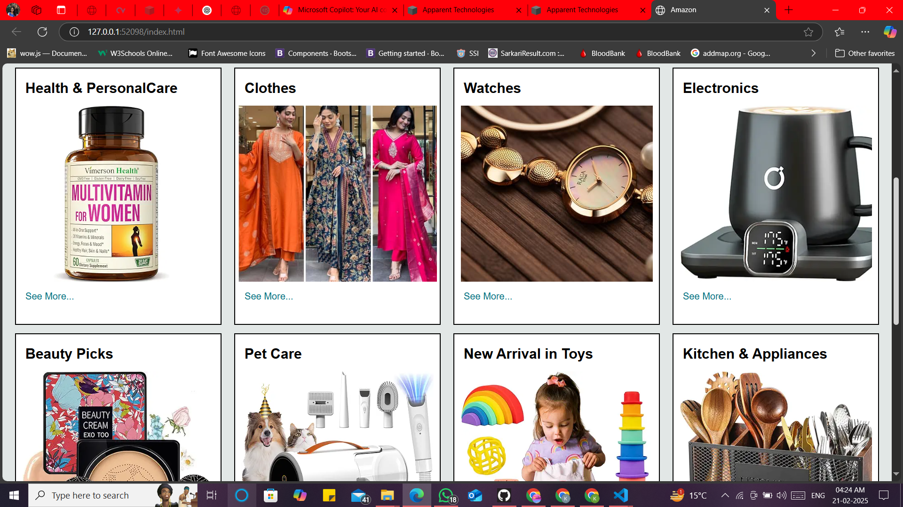
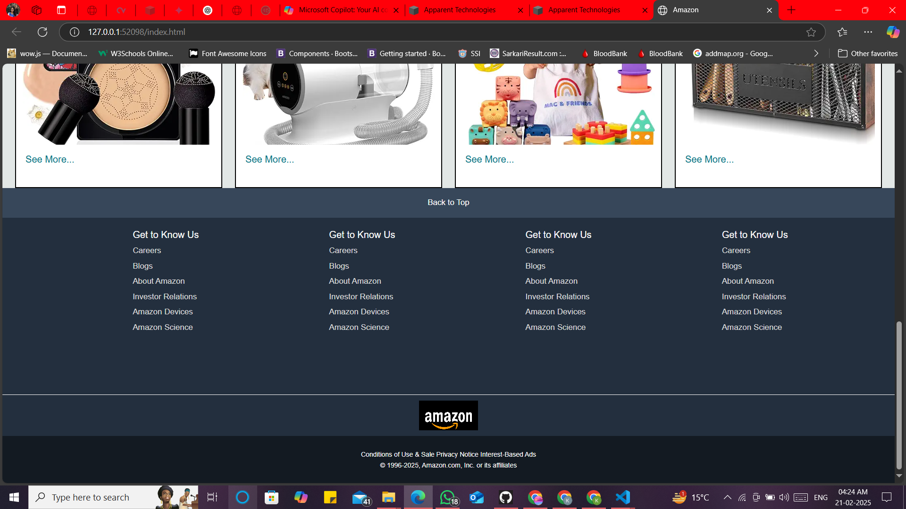

# Amazon_Clone ---

This is an Amazon clone project built using HTML, CSS, and JavaScript.   It includes a responsive homepage, product listing, and a shopping cart UI.   The design is inspired by Amazon’s layout, and it supports basic interactions   like product hover effects, search bar functionality, and category filtering.

1️⃣ Project Title & Description

# Amazon Clone - E-commerce Website --- 

This is a fully responsive **Amazon Clone** built using **HTML, CSS, and JavaScript**.  
It replicates the UI of Amazon and includes features like product listing and a shopping cart.

2️⃣ Features 

##  Features :---

 Mobile-friendly responsive design 
 Interactive product listing 
 Shopping cart functionality 
 Dynamic search bar  
 User-friendly navigation 
 
3️⃣ Technologies Used

##  Technologies Used :---

- **Frontend:** HTML, CSS, JavaScript  
- **Icons & Styling:** FontAwesome, Google Fonts  
- **Deployment:** GitHub Pages (Optional)

4️⃣ Installation & Setup

##  Installation & Usage :---

Follow these steps to run the project locally:

1️⃣ **Clone the repository :--**
```sh
git clone https://github.com/your-username/Amazon-Clone.git

2️⃣ Navigate to the project folder:
cd Amazon-Clone

3️⃣ Open index.html in a browser
Open manually, or
Use Live Server in VS Code.


---

#### **5️⃣ Future Enhancements**
```md
##  Future Enhancements:
- Implement user authentication (Sign In/Sign Up)  
- Integrate backend with database (Node.js, Express, MySQL, or Firebase)  
- Add a payment gateway (Stripe, Razorpay, PayPal)

6️⃣ License

##  License:
This project is open-source and available under the **MIT License**.  
Feel free to contribute and enhance it! 





